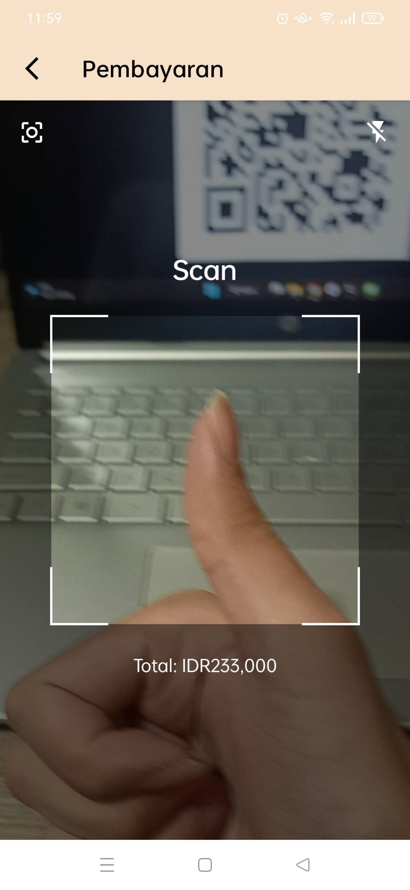
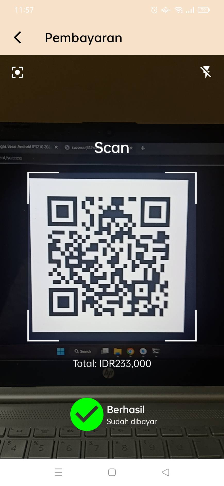
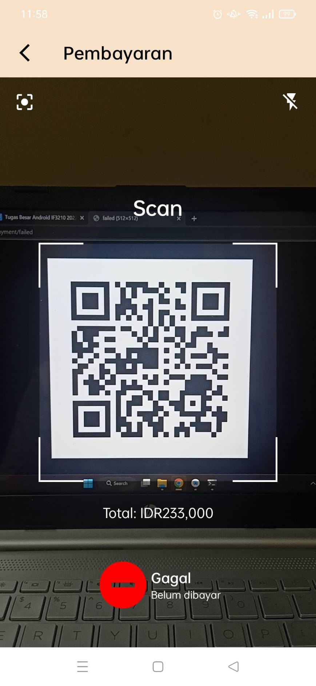
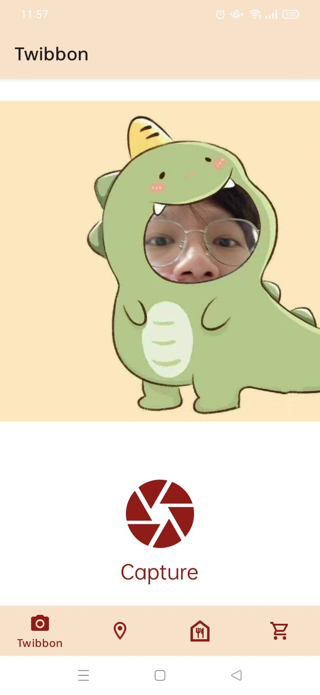
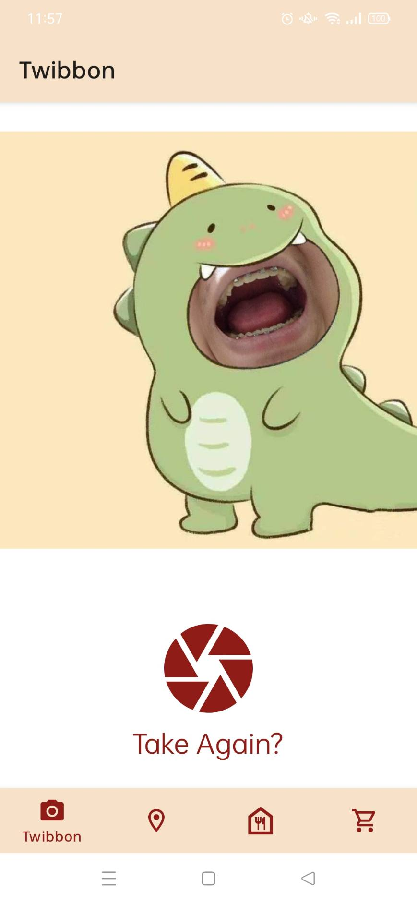

# IF3210-2023-Android-CUM

Majika is a mobile application that allows users to order food from Majika Restautrant. This application is made for IF3210 - Platform Based Development course at Institut Teknologi Bandung.

## Libraries

- retrofit
- yuriy-budiyev code-scanner
- camerax

## Screenshots
### Menu
* Portrait \

* Landscape \

### Restoran
* Portrait \

### Keranjang
* Portrait \

### Pembayaran
* Idle \

* Success \

* Failed \

### Twibbon
* Idle \

* Take \

## Workload
*   13520025 Fransiskus Davin Anwari: 
    - [x] Menu
    - [x] Keranjang
    - [x] Database
    - [x] Temperature
*   13520069 Kent Liusudarso: 
    - [x] Twibbon
    - [x] Pembayaran
    - [x] Navigation
    - [x] Camera
*   13520167 Aldwin Hardi Swastia
    - [x] Restoran
    - [x] Splash Screen
    - [x] Retrofit
    - [x] Recycler View
## Time Wasted
*   13520025 Fransiskus Davin Anwari:  30 hours
*   13520069 Kent Liusudarso: 30 hours
*   13520167 Aldwin Hardi Swastia   : 30 hours